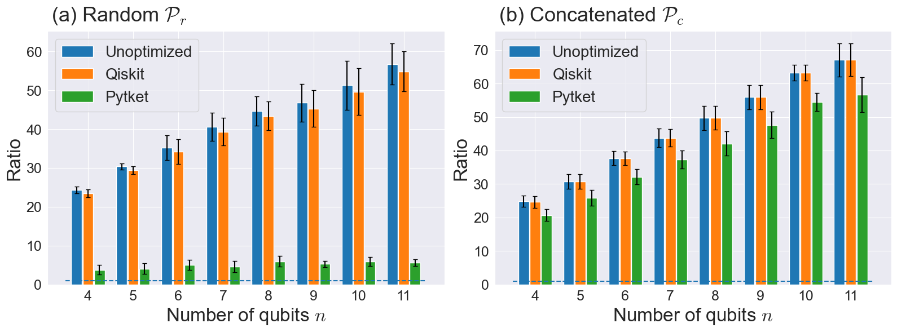
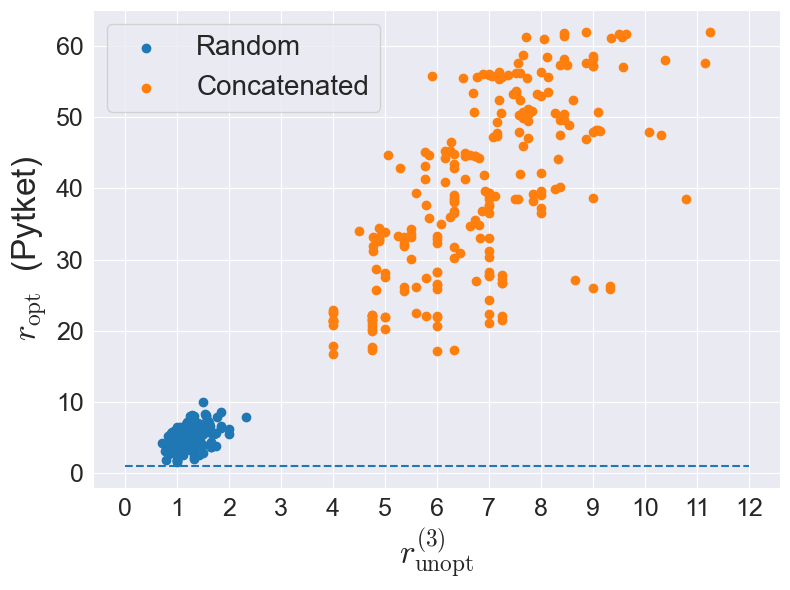

# Quantum Circuit Unoptimization

Quantum compiler benchmark using dataset generated by quantum circuit unoptimization.

# Requirements

Quantum circuit unoptimization operates on Python 3.9.0+, and the required packages are described in `requreiemnts.txt`.
For installation, run :

```bash
git clone https://github.com/Yousaymori0812/QCUnopt.git
```

After that, run :

```bash
pip install -r requirements.txt
```

# Executing Compiler Benchmarks

We provide two types of compiler benchmarking: single-threaded version and single-threaded version. Please choose one of them and uncomment it. And then, run:

```bash
python main.py
```

After execution, two output files will be generated:

- `result.csv` containing the ratio of the unoptimized circuit: $r_{\mathrm{unopt}}$ in Eq. (5), and the ratio of the optimized circuit by compilers: $r_{\mathrm{opt}}$ in Eq. (6).
- `result_unopt_level.csv` containing the ratio of unoptimized circuit merged into the three-qubit
blocks: $r^{(3)}_{\mathrm{unopt}}$ in Eq. (7).

Additionally, a file named "result_time.csv" will be produced for the single-thread version, reporting the execution time.

# Example code

To obtain detailed instructions for generating benchmarks through quantum circuit unoptimization, please refer to [`simulation.ipynb`](simulation.ipynb). Also, [`visualization.ipynb`](visualization.ipynb) provides an example of visualizing compiler benchmark results.

　
